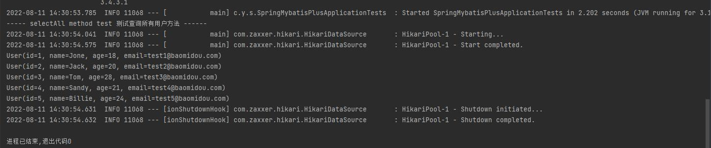

# springboot-mybatis-plus

springboot 整合 mybatis-plus 应用

> 参考: [https://blog.csdn.net/CodeInCoke/article/details/121030290](https://blog.csdn.net/CodeInCoke/article/details/121030290)

## mybatis-plus 

MyBatis-Plus (opens new window)（简称 MP）是一个 MyBatis (opens new window)的增强工具，在 MyBatis 的基础上只做增强不做改变，为简化开发、提高效率而生。

> 特性 (官网提供)

- **无侵入**：只做增强不做改变，引入它不会对现有工程产生影响，如丝般顺滑
- **损耗小**：启动即会自动注入基本 CURD，性能基本无损耗，直接面向对象操作，BaseMapper
- **强大的 CRUD 操作**：内置通用 Mapper、通用 Service，仅仅通过少量配置即可实现单表大部分 CRUD 操作，更有强大的条件构造器，满足各类使用需求，简单的CRUD操作不用自己编写。
- **支持 Lambda 形式调用**：通过 Lambda 表达式，方便的编写各类查询条件，无需再担心字段写错
- **支持主键自动生成**：支持多达 4 种主键策略（内含分布式唯一 ID 生成器 - Sequence），可自由配置，完美解决主键问题
- **支持 ActiveRecord 模式**：支持 ActiveRecord 形式调用，实体类只需继承 Model 类即可进行强大的 CRUD 操作
- **支持自定义全局通用操作**：支持全局通用方法注入（ Write once, use anywhere ）
- **内置代码生成器**：采用代码或者 Maven 插件可快速生成 Mapper 、 Model 、 Service 、 Controller 层代码，支持模板引擎，更有超多自定义配置等您来使用（自动生成代码）
- **内置分页插件**：基于 MyBatis 物理分页，开发者无需关心具体操作，配置好插件之后，写分页等同于普通 List 查询
- **分页插件支持多种数据库**：支持 MySQL、MariaDB、Oracle、DB2、H2、HSQL、SQLite、Postgre、SQLServer 等多种数据库
- **内置性能分析插件**：可输出 SQL 语句以及其执行时间，建议开发测试时启用该功能，能快速揪出慢查询
- **内置全局拦截插件**：提供全表 delete 、 update 操作智能分析阻断，也可自定义拦截规则，预防误操作

## 快速入门

#### 1. 创建数据库&表

```
DROP TABLE IF EXISTS user;

CREATE TABLE user
(
	id BIGINT(20) NOT NULL COMMENT '主键ID',
	name VARCHAR(30) NULL DEFAULT NULL COMMENT '姓名',
	age INT(11) NULL DEFAULT NULL COMMENT '年龄',
	email VARCHAR(50) NULL DEFAULT NULL COMMENT '邮箱',
	PRIMARY KEY (id)
);
-- 真实开发中，version(乐观锁)、deleted(逻辑删除)、gmt_create(创建时间)、gmt_modified(修改时间)

INSERT INTO user (id, name, age, email) VALUES
(1, 'Jone', 18, 'test1@baomidou.com'),
(2, 'Jack', 20, 'test2@baomidou.com'),
(3, 'Tom', 28, 'test3@baomidou.com'),
(4, 'Sandy', 21, 'test4@baomidou.com'),
(5, 'Billie', 24, 'test5@baomidou.com');
```

#### 2. 添加依赖

```
<!-- mybatis-plus -->
<dependency>
    <groupId>com.baomidou</groupId>
    <artifactId>mybatis-plus-boot-starter</artifactId>
    <version>3.4.3.1</version>
</dependency>
```

_注意：使用mybatis-plus可以节省大量代码，不要同时导入mybatis和mybatis-plus，可能存在版本冲突_

#### 3. 使用mybatis-plus

- 在启动类加上**@mapper**注解,扫描**mapper**文件夹

```
@MapperScan("com.yang.springmybatisplus.mapper")
@SpringBootApplication
public class SpringMybatisPlusApplication 
```

- 创建pojo类

```
@Data
@AllArgsConstructor
@NoArgsConstructor
public class User {
    private Long id;
    private String name;
    private Integer age;
    private String email;
}
```

- mapper接口

```
@Repository
public interface UserMapper extends BaseMapper<User> {
}
```

mybatis-plus已经配置完成，可以直接使用，CRUD

- 使用测试类**@Test**测试

```
@Autowired
private UserMapper userMapper;

@Test
void contextLoads() {
    System.out.println(("----- selectAll method test 测试查询所有用户方法 ------"));
    //selectList 的参数wrapper 是条件构造器，可以先写null
    List<User> userList = userMapper.selectList(null);
    //forEach 的参数是 Consumer类型的 语法糖
    userList.forEach(System.out::println);
}
```

运行contextLoads, 查看结果

